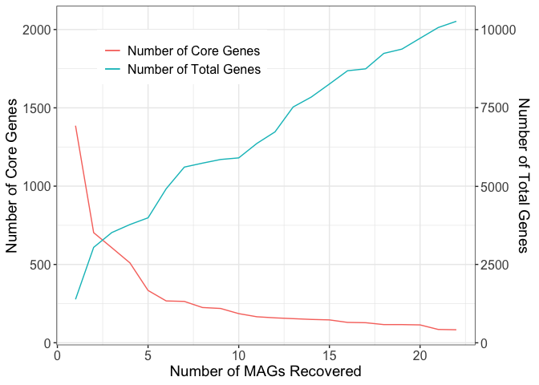

Generating Figures for Moulana et al.
================
Alief Moulana
7/10/2019
More detailed .md file is in pangenome-selection.md

## Taxonomy distribution and pangenomic profile

We performed the common metagenomic pipeline of assembly, mapping,
binning, and annotation (see Methods). Then, we generated Supplementary
Figure 1 on a spread sheet using the taxonomy data we obtained from
“phylosift”. Because Sulfurovum was the most abundant genus in both
Mid Cayman Rise and Axial genomes, we used Sulfurovum MAGs in the
subsequent pangenome analyses following “anvi’o” pangenome workflow.
Then we captured Figure 1A using command `anvi-display-pan` with genomes
storage and pangenome databases generated from the previous steps.
Moreover, we obtained the summary of the pangenome profile (the cluster
file) by running the command `anvi-summarize` for the PAN DB. We also
analyzed how the pattern of total and core genome accumulation as more
MAGs considered. We visualize the result from the chunk below
(Supplementary Figure 2).

<!-- -->

Moreover, we also analyze the similarity in gene content among MAGs. We
first run `similarity_matrix.py` which takes the cluster file as an
input and produces the file `similarity_matrix.txt`. The program
produces a 22-by-22 matrix, where each entry \(ij\) represents the
proportion of genes in the \(i\)th MAG that is also contained by the
\(j\)th MAG. We then visualize the matrix and find the distance among
the genomes in the following chunk.
