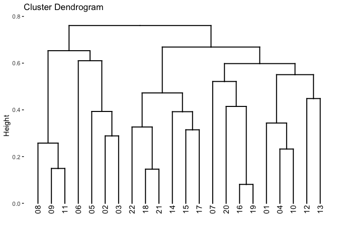
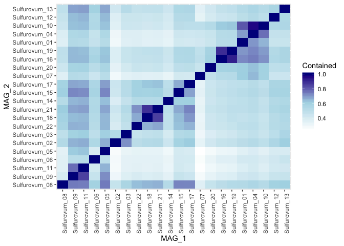

Generating Figures for Moulana et al.
================
Alief Moulana
7/10/2019

``` r
knitr::opts_chunk$set(echo = TRUE)


#load all necessary packages
library(reshape2)
library(ggplot2)
library(tidyverse)
library(tidyr)
library(dplyr)
library(stringr)
library(factoextra)

#load all the data needed

pangenome <- as.matrix(read.table('txt_files/similarity_matrix.txt', 
                                  quote = "",sep='\t',header=FALSE)) 
#load the similarity matrix data

cluster<- read.table('txt_files/Sulfurovum_gene_clusters_summary_cleaned.txt',sep='\t',quote="",header=TRUE) 
#load the summarized sulfurovum pangenome profile from anvi'o
```

## Taxonomy distribution and pangenomic profile

We performed the common metagenomic pipeline of assembly, mapping,
binning, and annotation (see Methods; refer to citations). Because
Sulfurovum was the most abundant genus in both Mid Cayman Rise and Axial
genomes, we used Sulfurovum MAGs in the subsequent pangenome analyses
following “anvi’o” pangenome workflow. Then we captured Figure 1A using
command `anvi-display-pan` with genomes storage and pangenome databases
generated from the previous steps. Moreover, we obtained the summary of
the pangenome profile (the cluster file) by running the command
`anvi-summarize` for the PAN DB. We also analyzed how the pattern of
total and core genome accumulation as more MAGs considered. We visualize
the result from the chunk below (Supplementary Figure 2).

``` r
cluster.basic.count <- unique(data.frame(Group=cluster$gene_cluster_id,
                                  Number=cluster$num_genomes_gene_cluster_has_hits,
                                  Genome=cluster$genome_name)) 
#create df, remove duplicates
cluster.basic.count$Group <- as.character(cluster.basic.count$Group)

#reshape df
cluster.basic.reshaped <- reshape(cluster.basic.count,v.names="Number",
                                  timevar="Genome",idvar=c("Group"),direction="wide")
cluster.basic.matrix <- as.matrix(cluster.basic.reshaped[,2:23]) #turn into matrix
cluster.basic.matrix[] <- c(TRUE,FALSE)[(is.na(cluster.basic.matrix) )+ 1] #binary

total.each.genome <- apply(cluster.basic.matrix,2,sum) #numb of gene groups per genome

#create a function returning whether or not the sum of a row up until i equals i
count.sum <- function(row,i){
  sum(row[1:i]) == i
}

#create a vector that count the number of core genes taking into account i genomes
core.now <- c()
for(j in 1:22){
  core.now[j] <- sum(apply(cluster.basic.matrix,1,count.sum,j))
}

#create a function to perform the analysis below
count.sum.2 <- function(numb,x){
  var <- sum(apply(as.matrix(cluster.basic.matrix[,1:x-1]),1,sum) ==0 & 
               cluster.basic.matrix[,x] == 1)
  return(numb+var)
}

#create a vector that expands number of genes as more genomes sequenced
total.now <- c()
total.now[1] <- total.each.genome[1]
count <- total.now[1]
for(k in 2:22){
  total.now[k] <- count.sum.2(count,k)
  count <- total.now[k]
}
#merge the core now and total now
count.groups <- data.frame(Number=c(1:22),Core=core.now,Total=total.now)
ggplot(count.groups,aes(x=Number))+
  geom_line(aes(y=Core,colour="Number of Core Genes"))+
  geom_line(aes(y=Total/5,colour="Number of Total Genes"))+
  scale_y_continuous(sec.axis = sec_axis(~.*5, name = "Number of Total Genes"))+
  xlab("Number of MAGs Recovered") +
  ylab("Number of Core Genes") +
  labs(colour = "Parameter")+
  theme_bw()+
  theme(axis.text=element_text(size=12),
        legend.text=element_text(size=12),
        legend.title=element_blank(),
        axis.title=element_text(size=14),
        legend.position = c(0.3, 0.85))
```


Moreover, we also analyze the similarity in gene content among MAGs. We
first run `similarity_matrix.py` which takes the cluster file as an
input and produces the file `similarity_matrix.txt`. The program
produces a 22-by-22 matrix, where each entry \(ij\) represents the
proportion of genes in the \(i\)th MAG that is also contained by the
\(j\)th MAG. We then visualize the matrix and find the distance among
the genomes in the following chunk.

``` r
# create genome names
twenty_two <- as.character(c(1:22))
genome_numbering <- ifelse(nchar(twenty_two) == 1,
                           paste(as.character(0),twenty_two,sep=""),
                           as.character(twenty_two))
genome_names <- paste("Sulfurovum",genome_numbering,sep="_")

# then manipulate the data for the heatmap where each square represents the percentage of genes in genome 1 contained in genome 2
heat_map.data <- data.frame(pangenome)
colnames(heat_map.data) <- genome_names
heat_map.data$genome <- genome_names

# melt the data from a large matrix to pairwise rows
heat_map.data.melt <- melt(heat_map.data, id=c("genome"))
colnames(heat_map.data.melt)<-c("MAG_1", "MAG_2", "Contained")

# cluster the data based on the genome content overlap
a <- hclust(as.dist(1-heat_map.data[, -23]))
library(factoextra)
dend_plot <- fviz_dend(a)
dend_plot # this gets the dendrogram
```

<!-- -->

``` r
order <- a$order

# order the MAGs based on the clustering
heat_map.data.melt$MAG_1 <- factor(heat_map.data.melt$MAG_1, levels=ifelse(order < 10, paste0("Sulfurovum_0", order), paste0("Sulfurovum_", order)))
heat_map.data.melt$MAG_2 <- factor(heat_map.data.melt$MAG_2, levels=ifelse(order < 10, paste0("Sulfurovum_0", order), paste0("Sulfurovum_", order)))

# plot the heatmap
ggplot(data = heat_map.data.melt, aes(x = MAG_1, y = MAG_2)) +
  geom_tile(aes(fill = Contained))+
  scale_fill_gradientn(colours = c("white", "lightblue", "darkblue"), values = c(0,0.5,1))+
  theme(axis.text.x = element_text(angle = 90, hjust = 1))
```

<!-- -->

Because our pangenome is created upon metagenomes, we need to be careful
when declaring a gene to be in the core genome. We simulate the
probability that a gene found in \(n\) genomes to be actually a core
genome, exlcluding genes found in 22 genomes.

``` r
# summary file created based on `anvi-summarize` output
summary_data <- read.table('txt_files/sulfurovum_summary.txt',
                           sep='\t',header=TRUE,quote="",na.strings = "",fill = TRUE )

# function that takes in a number i and outputs the probability that a gene is a missing gene in the ith genome
gene.chance<-function(i){
  data.selected <- summary_data[i,] # look at the ith row of data
  mean.complete <- 100*data.selected$number_genes/data.selected$completion # approximate total number of genes
  sd.complete <- -(mean.complete-data.selected$number_genes)/(qnorm(data.selected$redundancy/100)) # approximate standard deviation
  missing.genes <- rnorm(1,mean.complete,sd.complete) # total number of genes supossedly under normal distribution
  return(missing.genes/(10263-data.selected$number_genes)) # probability a gene outside this genome is a missing gene in this genome
}

# run the simulation (pretty long)
collection <- data.frame(MAGs=as.factor(c()),
                         Probability=as.numeric(c()))
N<-100
for (i in 1:21){
  for (j in 1:N){
    sampled <- as.matrix(sample(1:22, i, replace=F)) # sample i genomes without replacement
    missing <- apply(sampled,1,gene.chance) # row by row apply function above
    collection <- rbind(collection,c(22-i,prod(missing))) # ML by calculate the product
  }
}

colnames(collection) = c("MAGs","Probability")
collection$MAGs <- as.factor(collection$MAGs)

# the plot
ggplot(collection,mapping=aes(x=MAGs,y=Probability))+
  scale_y_log10()+
  geom_boxplot()+
  theme_bw()+
  theme(axis.text=element_text(size=18),
        legend.text=element_text(size=18),
        axis.title=element_text(size=24))+
  labs(x="Number of MAGs",
       y="Probability of Core")+
  geom_hline(yintercept=0.05,color="red")
```


## The distinct functions between high- and low-frequency genes
